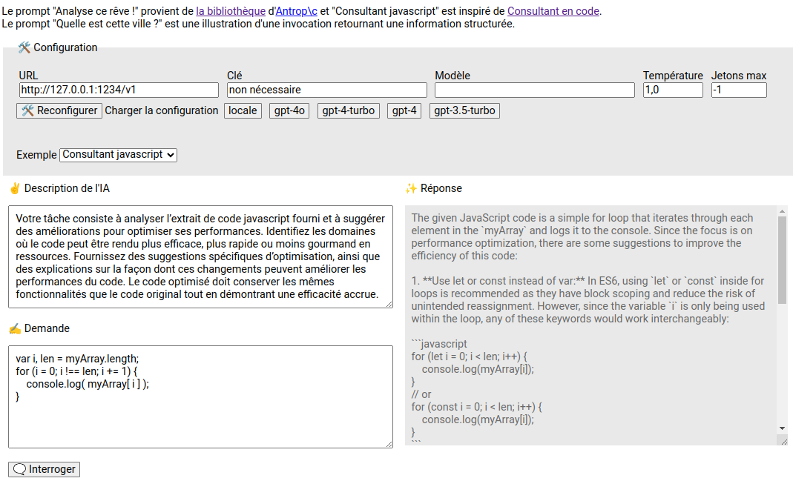
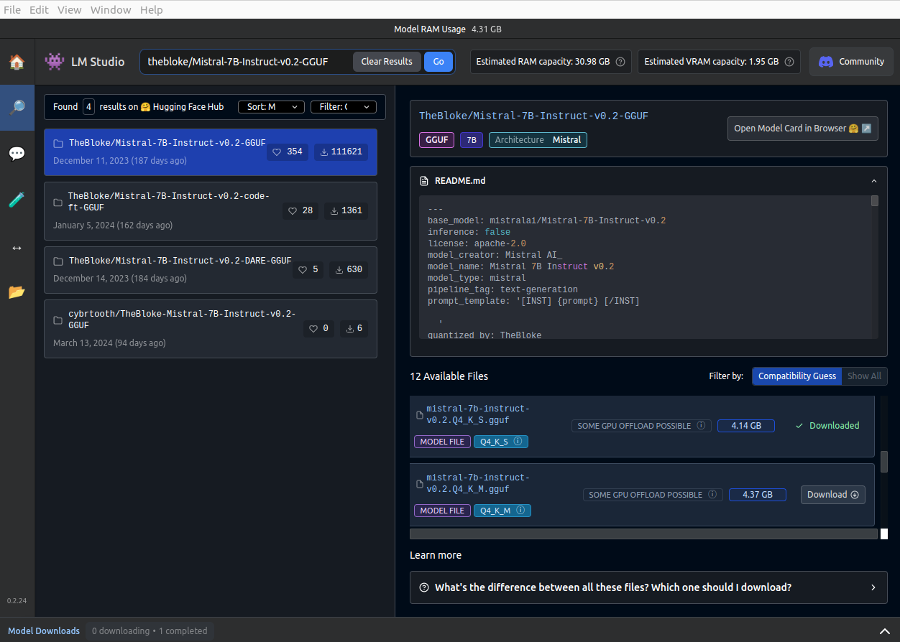

# AI walkthrough : LLM & intégration

Cette page fournit des explications sur la découverte de quelques outils en lien avec l'intelligence artificielle, sur le volet utilisation et intégration de Large Language Models (LLMs).

Un LLM est un modèle d'apprentissage profond entraîné sur un gros volume de données capable de comprendre et générer des informations en langage avancé : langage naturel, traduction de texte, résolution de problèmes, etc.

## Langchain - Intégration dans une page HTML

### La page de démo

Ouvrir la page html :
```sh
open index.html
```

Le CDN [esm.sh](https://esm.sh) est utilisé. Il permet d'importer des modules ES6 directement dans le navigateur à partir d'une URL et ne nécessite donc pas d'étape de build.

Le framework [LangChain](https://js.langchain.com/) facilite l'intégration avec les LLMs, avec son [API javascript](https://api.js.langchain.com/index.html) bien documentée.

L'interface proposée est composée d'un encart de configuration / reconfiguration et de deux colonnes :
* la définition du prompt : la description de l'IA (`system`) et la demande (`human`)
* la réponse qui arrive au fur et à mesure



Au lancement, le chat est configuré avec l'URL `http://127.0.0.1:1234/v1`, qui correspond à un endpoint OpenAI d'un LLM exposé localement sur le port `1234`.

Trois prompts prédéfinis  sont proposés dans la liste, mais rien n'empêche de saisir le sien.

### Le coeur du code

```js
// Imports des modules ES6
import { ChatOpenAI } from "https://esm.sh/@langchain/openai";
import { HumanMessage, SystemMessage } from "https://esm.sh/@langchain/core/messages";
import { StringOutputParser } from "https://esm.sh/@langchain/core/output_parsers";

// Création du chat
const chat = new ChatOpenAI({
  apiKey: 'non nécessaire',
  model: '',
  temperature: 1.0,
  maxTokens: -1,
}, {
  basePath: 'http://127.0.0.1:1234/v1'
});

// Pour récupérer directement le contenu sous forme de chaine de caractères (la réponse json complète ne nous intéresse pas)
const parser = new StringOutputParser();

// Pour annuler le traitement
const abortController = new AbortController();

// Prompt
const messages = [
  new SystemMessage('Vous êtes un assistant IA avec une compréhension profonde de l’interprétation des rêves [...]'),
  new HumanMessage('J’ai fait un rêve la nuit dernière dans lequel je marchais à travers une forêt dense. [...]'),
];

// Obtenir une réponse en streaming
const stream = await chat.pipe(parser).stream(messages, { signal: abortController.signal });
for await (const chunk of stream) {
  responseElt.textContent += chunk/*sans le parser : chunk.content*/;
}

// Si besoin d'annuler le traitement
// abortController.abort();
```

## Exécution locale d'un LLM

### LM Studio - téléchargement et exécution de modèles

[LM Studio](https://lmstudio.ai/) permet de télécharger des modèles LLMs depuis les registres [HuggingFace](https://huggingface.co/) et de les exécuter sur son PC sans connexion. Il permet également d'exposer des web services conforme à l'API OpenAI pour faciliter l'intégration avec d'autres outils et à un utilisateur d'interroger directement le modèle avec un chat intégré.



Depuis peu, il embarque une CLI nommé `lms`.

#### Installation

Consulter directement la document de https://lmstudio.ai/.

Exemple d'installation Linux :
```sh
LMS_VERSION=0.2.24

# Téléchargement
curl -O https://releases.lmstudio.ai/linux/${LMS_VERSION}/beta/LM_Studio-${LMS_VERSION}.AppImage
chmod u+x LM_Studio-${LMS_VERSION}.AppImage  

# Exécution 
./LM_Studio-${LMS_VERSION}.AppImage
```

Des fichiers sont créés dans le répertoire `~/.cache/lm-studio`, et le CLI peut être ajouter dans le `PATH` avec la commande :
```sh
~/.cache/lm-studio/bin/lms bootstrap
```

Par la suite, le CLI est utilisable directement :
```sh
lms --help
```

#### Exécution

Démarrage du serveur, en activant CORS (sera utile dans la suite) :
```sh
# Démarre le serveur
lms server start --cors
```

#### Chargement d'un modèle

Pour l'exemple, on choisit le modèle [TheBloke/Mistral-7B-Instruct-v0.2-GGUF](https://huggingface.co/TheBloke/Mistral-7B-Instruct-v0.2-GGUF) qu'on télécharge avec LM Studio ou avec la commande suivante :
```sh
(
  MODEL_USER=TheBloke
  MODEL_NAME=Mistral-7B-Instruct-v0.2-GGUF
  MODEL_VERSION=mistral-7b-instruct-v0.2.Q4_K_S.gguf

  mkdir -p ~/.cache/lm-studio/models/${MODEL_USER}/${MODEL_NAME}/
  cd ~/.cache/lm-studio/models/${MODEL_USER}/${MODEL_NAME}/
  curl -L -o ${MODEL_VERSION} https://huggingface.co/${MODEL_USER}/${MODEL_NAME}/resolve/main/${MODEL_VERSION}?download=true
)
```

Si besoin, utiliser le [moteur de recherche d'Hugging Face](https://huggingface.co/) pour en trouver un autre.

Puis chargement du modèle :
```sh
lms load ${MODEL_USER}/${MODEL_NAME}
```

Réponse :
```sh
I Loading model "TheBloke/Mistral-7B-Instruct-v0.2-GGUF/mistral-7b-instruct-v0.2.Q4_K_S.gguf"...
I Model loaded successfully in 4.14s. (4.14 GB)
I To use the model in the API/SDK, use the identifier "TheBloke/Mistral-7B-Instruct-v0.2-GGUF/mistral-7b-instruct-v0.2.Q4_K_S.gguf".
I To set a custom identifier, use the --identifier <identifier> option.
```

Vérification :
```sh
lms status
```

Réponse :
```sh
┌ Status ───────────────────────────────────────────────────────────────────────────────────────┐
│                                                                                               │
│   Server:  ON  (Port: 1234)                                                                   │
│                                                                                               │
│   Loaded Models                                                                               │
│     · TheBloke/Mistral-7B-Instruct-v0.2-GGUF/mistral-7b-instruct-v0.2.Q4_K_S.gguf - 4.14 GB   │
│                                                                                               │
└───────────────────────────────────────────────────────────────────────────────────────────────┘
```

#### Consommation des web services

Liste des modèles :
```sh
curl http://localhost:1234/v1/models
```

Réponse :
```json
{
  "data": [
    {
      "id": "TheBloke/Mistral-7B-Instruct-v0.2-GGUF/mistral-7b-instruct-v0.2.Q4_K_S.gguf",
      "object": "model",
      "owned_by": "organization-owner",
      "permission": [
        {}
      ]
    }
  ],
  "object": "list"
}
```

Interrogation du modèle sans streaming :

```sh
curl http://localhost:1234/v1/chat/completions \
  -H "Content-Type: application/json" \
  -d '{
  "model": "TheBloke/Mistral-7B-Instruct-v0.2-GGUF/mistral-7b-instruct-v0.2.Q4_K_S.gguf",
  "messages": [ 
    { "role": "system", "content": "Tu es un architecte logiciel. Tes réponses sont concises et tu fournis tes sources." },
    { "role": "user", "content": "Pourquoi utiliser docker ?" }
  ], 
  "temperature": 0.7, 
  "max_tokens": -1,
  "stream": false
}'
```

Réponse potentielle :
```json
{
  "id": "chatcmpl-mfeh2yte71jizjj11su4ts",
  "object": "chat.completion",
  "created": 1716475664,
  "model": "TheBloke/Mistral-7B-Instruct-v0.2-GGUF/mistral-7b-instruct-v0.2.Q4_K_S.gguf",
  "choices": [
    {
      "index": 0,
      "message": {
        "role": "assistant",
        "content": " Docker est utilisé pour containerizer des applications, ce qui offre plusieurs avantages :\n\n1. **Isolation**: Chaque conteneur contient tout ce qu'il nécessite pour fonctionner et ne peut interagir directement avec d'autres conteneurs ou le système hôte, ce qui améliore la sécurité et la stabilité de l'application.\n\n2. **Portabilité**: Des mêmes conteneurs peuvent être exécutés sur différentes plateformes (Windows, Linux, macOS) sans modification, car Docker prend en charge la création d'un environnement standardisé. Cela simplifie le déploiement et la maintenance de l'application.\n\n3. **Rapidité**: Conteneurs sont plus légers et plus rapides à mettre en place que des machines virtuelles, ce qui réduit les temps d'exécution et améliore l'expérience utilisateur.\n\n4. **Scalabilité**: Des applications peuvent être déployées sur plusieurs conteneurs pour gérer la charge de manière plus efficace et répondre à des demandes évoluant.\n\n5. **Simplification du déploiement et de la maintenance**: Docker simplifie le processus de déploiement en permettant d'utiliser des images prêtes à l'emploi, et facilite la maintenance grâce à des outils de gestion de conteneurs comme Docker Swarm ou Kubernetes.\n\nSources:\n- [Docker documentation](https://docs.docker.com/)\n- [Why Docker?](https://www.redhat.com/en/topics/containers/why-docker)"
      },
      "finish_reason": "stop"
    }
  ],
  "usage": {
    "prompt_tokens": 23,
    "completion_tokens": 395,
    "total_tokens": 418
  }
}
```

Ce qui, mis en forme donne :

Docker est utilisé pour containerizer des applications, ce qui offre plusieurs avantages :

1. **Isolation**: Chaque conteneur contient tout ce qu'il nécessite pour fonctionner et ne peut interagir directement avec d'autres conteneurs ou le système hôte, ce qui améliore la sécurité et la stabilité de l'application.

2. **Portabilité**: Des mêmes conteneurs peuvent être exécutés sur différentes plateformes (Windows, Linux, macOS) sans modification, car Docker prend en charge la création d'un environnement standardisé. Cela simplifie le déploiement et la maintenance de l'application.

3. **Rapidité**: Conteneurs sont plus légers et plus rapides à mettre en place que des machines virtuelles, ce qui réduit les temps d'exécution et améliore l'expérience utilisateur.
 
4. **Scalabilité**: Des applications peuvent être déployées sur plusieurs conteneurs pour gérer la charge de manière plus efficace et répondre à des demandes évoluant.

5. **Simplification du déploiement et de la maintenance**: Docker simplifie le processus de déploiement en permettant d'utiliser des images prêtes à l'emploi, et facilite la maintenance grâce à des outils de gestion de conteneurs comme Docker Swarm ou Kubernetes.

Sources:
- [Docker documentation](https://docs.docker.com/)
- [Why Docker?](https://www.redhat.com/en/topics/containers/why-docker)

Pour aller plus loin, LM Studio dispose d'un [SDK javascript](https://lmstudio.ai/docs/lmstudio-sdk/quick-start) qui permet de charger un modèle, converser, compléter du texte, etc.

#### Nettoyage
```sh
# En conservant les modèles
find ~/.cache/lm-studio/ -mindepth 1 -maxdepth 1 ! -name 'models' -exec rm -rf {} +

# Total
rm -rf ~/.cache/lm-studio/
```
