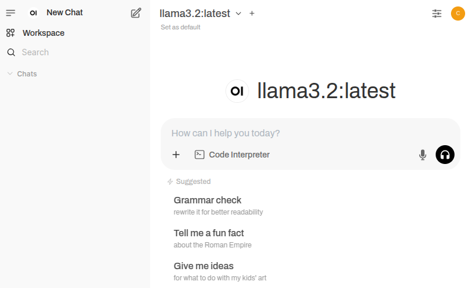
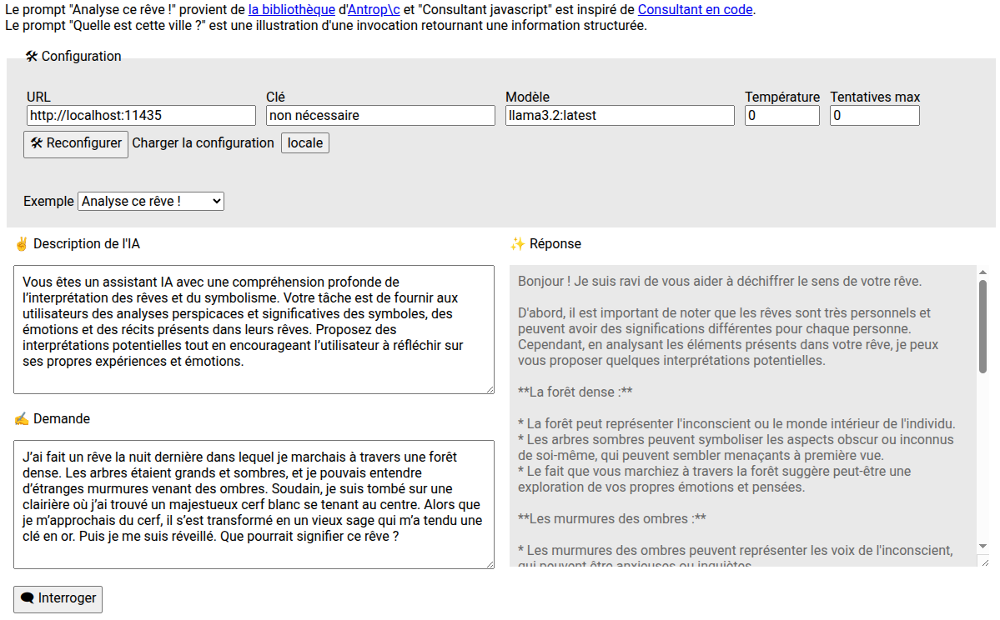

# AI walkthrough : LLM & intégration

Cette page fournit quelques informations sur la **découverte d'outils en lien avec l'intelligence artificielle**, sur le volet utilisation et intégration de **Large Language Models** (LLMs).

Un LLM est un modèle d'apprentissage profond entraîné sur un gros volume de données capable de comprendre et générer des informations en langage avancé : langage naturel, traduction de texte, résolution de problèmes, etc.

## Open WebUI et Ollama (`docker` et intégration)

Cf. [openwebui-with-ollama-in-docker/README.md](openwebui-with-ollama-in-docker/README.md)

**Interface utilisateur d'Open WebUI :**
* 

**Exemple de développement (intégration) :**
* 

## Langchain et LMStudio (intégration)

Cf. [langchain-with-lmstudio/README.md](langchain-with-lmstudio/README.md)

**Interface utilisateur de LMStudio :**
* 

**Exemple de développement (intégration) :**

* 
