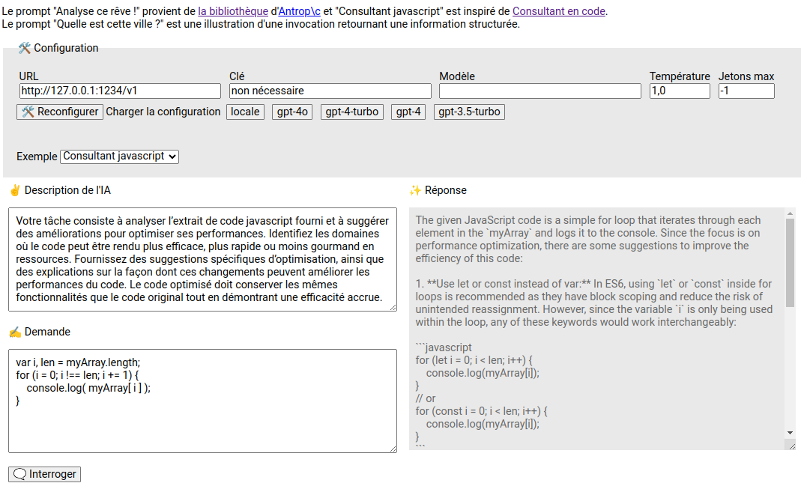
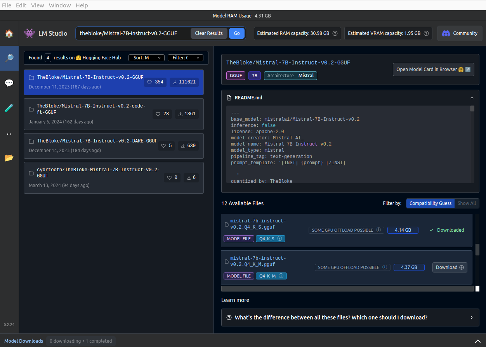

# AI walkthrough : Langchain with LMStudio

## Langchain - Intégration dans une page HTML

### La page de démo

Ouvrir la page html :
```sh
open index.html
```

Le CDN [esm.sh](https://esm.sh) est utilisé. Il permet d'importer des modules ES6 directement dans le navigateur à partir d'une URL et ne nécessite donc pas d'étape de build.

Le framework [LangChain](https://js.langchain.com/) facilite l'intégration avec les LLMs, avec son [API javascript](https://api.js.langchain.com/index.html) bien documentée.

L'interface proposée est composée d'un encart de configuration / reconfiguration et de deux colonnes :
* la définition du prompt : la description de l'IA (`system`) et la demande (`human`)
* la réponse qui arrive au fur et à mesure



Au lancement, le chat est configuré avec l'URL `http://127.0.0.1:1234/v1`, qui correspond à un endpoint OpenAI d'un LLM exposé localement sur le port `1234`.

Trois prompts prédéfinis  sont proposés dans la liste, mais rien n'empêche de saisir le sien.

### Le coeur du code

```js
// Imports des modules ES6
import { ChatOpenAI } from "https://esm.sh/@langchain/openai";
import { HumanMessage, SystemMessage } from "https://esm.sh/@langchain/core/messages";
import { StringOutputParser } from "https://esm.sh/@langchain/core/output_parsers";

// Création du chat
const chat = new ChatOpenAI({
  apiKey: 'non nécessaire',
  model: '',
  temperature: 1.0,
  maxTokens: -1,
}, {
  basePath: 'http://127.0.0.1:1234/v1'
});

// Pour récupérer directement le contenu sous forme de chaine de caractères (la réponse json complète ne nous intéresse pas)
const parser = new StringOutputParser();

// Pour annuler le traitement
const abortController = new AbortController();

// Prompt
const messages = [
  new SystemMessage('Vous êtes un assistant IA avec une compréhension profonde de l’interprétation des rêves [...]'),
  new HumanMessage('J’ai fait un rêve la nuit dernière dans lequel je marchais à travers une forêt dense. [...]'),
];

// Obtenir une réponse en streaming
const stream = await chat.pipe(parser).stream(messages, { signal: abortController.signal });
for await (const chunk of stream) {
  responseElt.textContent += chunk/*sans le parser : chunk.content*/;
}

// Si besoin d'annuler le traitement
// abortController.abort();
```

## Exécution locale d'un LLM

### LM Studio - téléchargement et exécution de modèles

[LM Studio](https://lmstudio.ai/) permet de télécharger des modèles LLMs depuis les registres [HuggingFace](https://huggingface.co/) et de les exécuter sur son PC sans connexion. Il permet également d'exposer des web services conforme à l'API OpenAI pour faciliter l'intégration avec d'autres outils et à un utilisateur d'interroger directement le modèle avec un chat intégré.



Depuis peu, il embarque une CLI nommé `lms`.

#### Installation

Consulter directement la document de https://lmstudio.ai/.

Exemple d'installation Linux :
```sh
LMS_VERSION=0.3.14-5

# Téléchargement
curl -O "https://installers.lmstudio.ai/linux/x64/${LMS_VERSION}/LM-Studio-${LMS_VERSION}-x64.AppImage"
chmod u+x "LM-Studio-${LMS_VERSION}-x64.AppImage"

# Exécution
# --no-sandbox : cf. https://github.com/lmstudio-ai/lmstudio-bug-tracker/issues/30
./LM-Studio-${LMS_VERSION}-x64.AppImage --no-sandbox
```

Des fichiers sont créés dans le répertoire `~/.lmstudio`, et le CLI peut être ajouter dans le `PATH` avec la commande :
```sh
~/.lmstudio/bin/lms bootstrap
```

Par la suite, le CLI est utilisable directement :
```sh
lms --help
```

#### Exécution

Démarrage du serveur, en activant CORS (sera utile dans la suite) :
```sh
# Démarre le serveur
lms server start --cors
```

#### Chargement d'un modèle

Pour l'exemple, on choisit le modèle [TheBloke/Mistral-7B-Instruct-v0.2-GGUF](https://huggingface.co/TheBloke/Mistral-7B-Instruct-v0.2-GGUF) qu'on télécharge avec LM Studio ou avec la commande suivante :
```sh
MODEL_USER=TheBloke
MODEL_NAME=Mistral-7B-Instruct-v0.2-GGUF
MODEL_VERSION=mistral-7b-instruct-v0.2.Q4_K_S.gguf

(
  mkdir -p ~/.lmstudio/models/${MODEL_USER}/${MODEL_NAME}/
  cd ~/.lmstudio/models/${MODEL_USER}/${MODEL_NAME}/
  curl -L -o ${MODEL_VERSION} "https://huggingface.co/${MODEL_USER}/${MODEL_NAME}/resolve/main/${MODEL_VERSION}?download=true"
)
```

Si besoin, utiliser le [moteur de recherche d'Hugging Face](https://huggingface.co/) pour en trouver un autre.

Puis chargement du modèle :
```sh
lms load ${MODEL_USER}/${MODEL_NAME}
```

Réponse :
```sh
Loading model "TheBloke/Mistral-7B-Instruct-v0.2-GGUF/mistral-7b-instruct-v0.2.Q4_K_S.gguf"...
Model loaded successfully in 2.95s. (4.14 GB)
To use the model in the API/SDK, use the identifier "mistral-7b-instruct-v0.2".
To set a custom identifier, use the --identifier <identifier> option.
```

Vérification :
```sh
lms status
```

Réponse :
```sh
   ┌ Status ────────────────────────────────────┐
   │                                            │
   │   Server:  ON  (Port: 1234)                │
   │                                            │
   │   Loaded Models                            │
   │     · mistral-7b-instruct-v0.2 - 4.14 GB   │
   │                                            │
   └────────────────────────────────────────────┘
```

#### Consommation des web services

Liste des modèles :
```sh
curl http://localhost:1234/v1/models
```

Réponse :
```json
{
  "data": [
    {
      "id": "mistral-7b-instruct-v0.2",
      "object": "model",
      "owned_by": "organization_owner"
    }
  ],
  "object": "list"
}
```

Interrogation du modèle sans streaming :

```sh
curl http://localhost:1234/v1/chat/completions \
  -H "Content-Type: application/json" \
  -d '{
  "model": "TheBloke/Mistral-7B-Instruct-v0.2-GGUF/mistral-7b-instruct-v0.2.Q4_K_S.gguf",
  "messages": [ 
    { "role": "assistant", "content": "Tu es un architecte logiciel. Tes réponses sont concises et tu fournis tes sources." },
    { "role": "user", "content": "Pourquoi utiliser docker ?" }
  ], 
  "temperature": 0.7, 
  "max_tokens": -1,
  "stream": false
}'
```

Réponse potentielle :
```json
{
  "id": "chatcmpl-o8f64wz4tcykwl2bci2j",
  "object": "chat.completion",
  "created": 1743426613,
  "model": "mistral-7b-instruct-v0.2",
  "choices": [
    {
      "index": 0,
      "logprobs": null,
      "finish_reason": "stop",
      "message": {
        "role": "assistant",
        "content": " Docker est utilisé pour wrapper des applications et leur fournir une même environnement de fonctionnement independentment du système d'exploitation hôte. Cela permet :\n\n1. Isoler les applications les unes des autres et de leurs dépendances.\n2. Simplifier la distribution et le déploiement des applications en fournissant tout ce qu'elles nécessitent dans un conteneur unique.\n3. Standardiser l'environnement et éliminer les incompatibilités de système d'exploitation, ce qui facilite le développement, le test et la production.\n4. Gérer plusieurs instances de l'application en parallèle, avec des ressources allouées différenciées, grâce à Docker Swarm ou Kubernetes.\n5. Faciliter la continuité de développement et la prise en compte de mises à jour de dépendances en utilisant des images Docker pré-construites.\n\nSources :\n1. \"What is Docker?\" by Docker (https://www.docker.com/whatisdocker)\n2. \"Why Use Docker?\" by Red Hat (https://cloud.redhat.com/en/topics/containers/why-use-docker)"
      }
    }
  ],
  "usage": {
    "prompt_tokens": 38,
    "completion_tokens": 284,
    "total_tokens": 322
  },
  "stats": {},
  "system_fingerprint": "mistral-7b-instruct-v0.2"
}
```

Pour aller plus loin, LM Studio dispose de SDK python ou typescript. Voir la [documentation](https://lmstudio.ai/docs/app).

#### Nettoyage
```sh
# En conservant les modèles
find ~/.lmstudio/ -mindepth 1 -maxdepth 1 ! -name 'models' -exec rm -rf {} +

# Total
rm -rf ~/.lmstudio/
```
