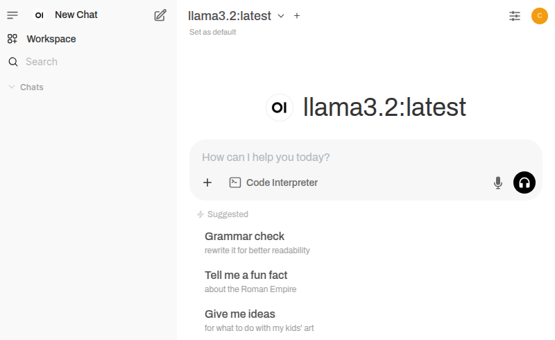
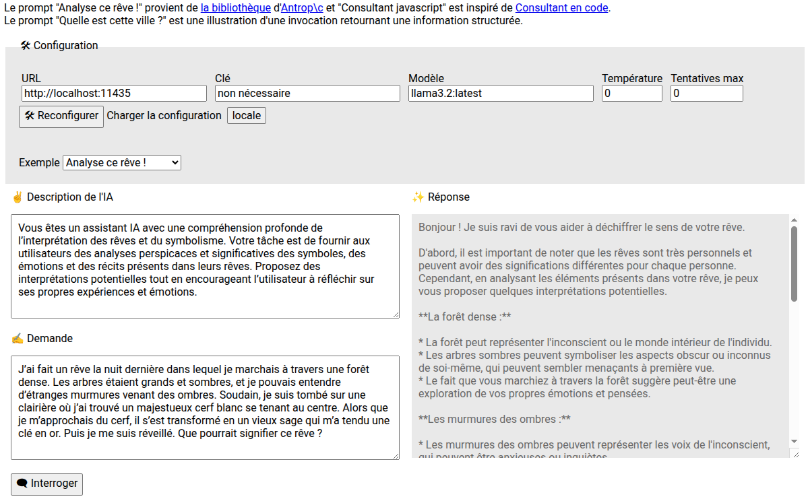

# Open WebUI with Ollama in docker

[Open WebUI](https://www.openwebui.com/) allows user to chat in a broswer with a local AI running with [Ollama](https://ollama.com/).

Tested with `llama3.2` (light) and `LoTUs5494/mistral-small-3.1:Q4_K_L`.

With `docker` installed and configured, run:
```sh
# Environment (to adapt)
cp .example.env .env

# Start
docker compose up -d --force-recreate
```

Open http://localhost:3000.
* Create an admin account
* "Select a model" and type a codename like `llama3.2` (see on [https://ollama.com/]())
* Click "Pull \"llama3.2\" from Ollama.com", model is downloaded
* Select "llama3.2:latest"
* And Chat



By default, configured with 1 GPU with `nvidia` driver. Read:
* https://hub.docker.com/r/ollama/ollama
* https://docs.nvidia.com/datacenter/cloud-native/container-toolkit/latest/install-guide.html#installation

Check GPU usage with: `nvidia-smi`

Stop and clean:
```sh
# Stop and remove container and network
docker compose down

# And volumes
docker compose down -v
```

## Intégration

Page de démonstration d'une intégration avec LangChain :
* cf. [index.html](index.html).

